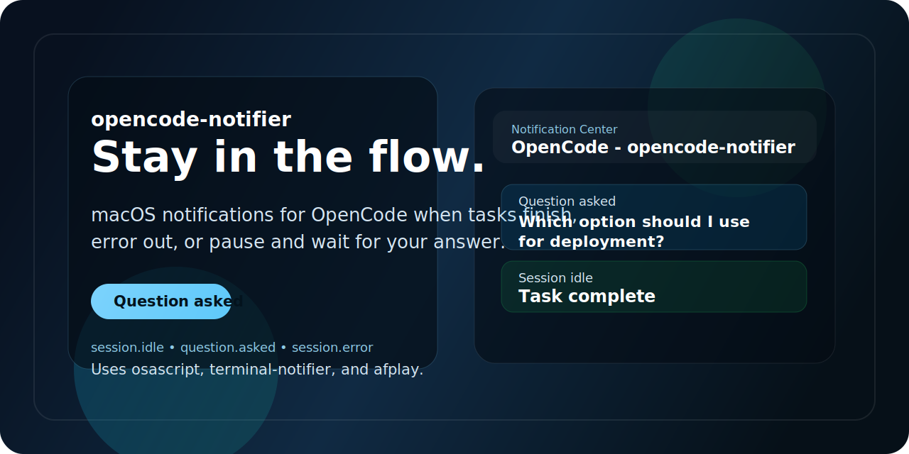

<p align="center">
  
</p>

<p align="center">
  <a href="./README.md"><strong>English</strong></a> ·
  <a href="./README.zh-CN.md"><strong>简体中文</strong></a>
</p>

<p align="center">
  <a href="https://github.com/sicaboy/opencode-notifier/releases"></a>
  <a href="https://github.com/sicaboy/opencode-notifier/stargazers"></a>
  <a href="https://github.com/sicaboy/opencode-notifier/blob/main/LICENSE"></a>
  
</p>

# opencode-notifier

## 功能

- OpenCode 回复完成后提醒
- OpenCode 中途停下来等你回答时提醒
- OpenCode 发生错误时提醒
- 不同事件播放不同声音
- 写入诊断日志，方便排查插件是否加载、事件是否触发

## 监听的事件

- `session.idle`
- `session.error`
- `question.asked`
- `permission.asked`

其中最关键的是：

- `question.asked`：对应“AI 中途停下来，让你选择或补充信息”

## 通知通道

- `osascript`：macOS 原生通知
- `terminal-notifier`：补充通知通道
- `afplay`：播放声音

## 依赖

- macOS
- OpenCode
- Homebrew
- `terminal-notifier`

安装：

```bash
brew install terminal-notifier
```

## 快速安装

```bash
mkdir -p ~/.config/opencode/plugins
cp notify.js ~/.config/opencode/plugins/notify.js
```

然后重启 `opencode`。

或者直接运行：

```bash
./scripts/install.sh
```

## 仓库文件

- `notify.js` - 可直接使用的插件
- `scripts/install.sh` - 安装脚本
- `examples/opencode.json` - 示例配置
- `README.md` - 英文说明
- `assets/banner.svg` - 顶部横幅图

## 日志排错

日志文件：

```bash
/tmp/opencode-notify.log
```

查看日志：

```bash
cat /tmp/opencode-notify.log
```

重点看这些内容：

- `plugin loaded`
- `event: question.asked`
- `event: session.idle`
- `osascript: ok`
- `terminal-notifier: ok`

## 测试系统通知

```bash
osascript -e 'display notification "OpenCode test" with title "OpenCode" subtitle "macOS"'
terminal-notifier -title "OpenCode" -subtitle "Test" -message "terminal-notifier test" -sound Glass
afplay /System/Library/Sounds/Glass.aiff
```

如果还是没有系统推送，请检查启动 `opencode` 的终端程序是否有通知权限。

## License

MIT
